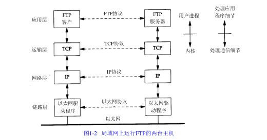
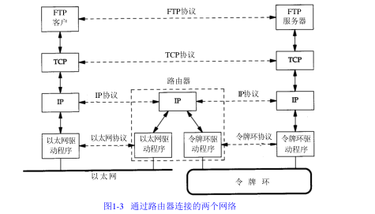
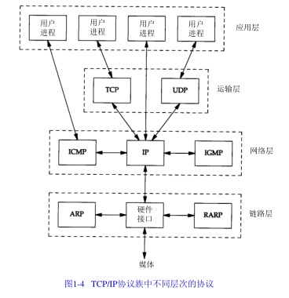
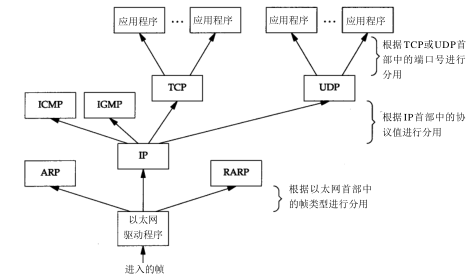

# 1.2 分层

|      | 作用               | 例子                 |
| ---- | ---------------- | ------------------ |
| 应用层   | 负责处理特定的应用程序细节   | Telnet、FTP和email等 |
| 运输层   | 两台主机上应用程序提供端到端的通信   | TCP和UDP |
| 网络层   | 处理分组在网络中的活动   | IP、ICMP和IGMP |
| 链路层   | 设备驱动程序和计算机中对应的网络接口卡   | 设备驱动程序及接口卡 |

大多数的网络应有程序都设计成客户-服务器模式。

从图中我们可以划分出端系统(两边的两台主机)和中间系统(中间的路由器)。应用层和运输层使用端到端协议，在图中，只有端系统需要这两层协议。但是，网络层提供的却是逐跳协议，两个端系统和每个中间系统都要使用它。

在TCP/IP协议族中，网络层IP提供的是一种不可靠的服务，它只是尽可能快地把分组从源结点送到目的结点，但是并不提供任何可靠性保证；TCP在不可靠的IP层上提供了一个可靠的运输层，为了提供可靠服务，TCP采用超时重传、发送和接收端到端的确认分组等机制。运输层和网络层分别负责不同的功能。

# 1.3 TCP/IP分层

# 1.4 互联网的地址

有三类IP地址：单播地址(目的为单个主机)、广播地址(目的端为给定网络上的所有主机)以及多播地址(目的端为同一组内的主机)。

# 1.5 域名系统

在TCP/IP领域中，域名系统(DNS)是一个分布的数据库，由它来提供IP地址和主机名之间的映射信息。

# 1.6 封装

当应用程序用TCP传送数据时，数据被送入协议栈中，然后逐个通过每一层直到被当作一串比特流送入网络，其中每一层对收到的数据都要增加一些首部信息(有时还要增加尾部信息)

IP首部中存入一个长度为8bit的数值，曾作协议域。1表示ICMP协议，2表示IGMP协议，6表示TCP协议，17表示UDP协议。

运输层协议在生成报文首部时要存入一个应用程序的标识符。TCP和UDP都用一个16bit的端口号来表示不同的应用程序。TCP和UDP把源端口号分别存入报文首部中。

# 1.7 分用

当目的主机收到一个以太网数据帧时，数据就开始从协议栈中由底上升，同时去掉各层协议加上的报文首部。每层协议盒都要去检查报文首部中的协议标识，以确定接收数据的上层协议。这个过程称作分用。

# 1.8 客户-服务器模型

重复型或并发型。重复型服务器通过以下步骤进行交互：

I1. 等待一个客户请求的到来。

I2. 处理客户请求。

I3. 发送响应给发送请求的客户。

I4. 返回I1 步。

重复型服务器主要的问题发生在I2状态。在这个时候，它不能为其他客户机提供服务。

相应地，并发型服务器采用以下步骤：

C1. 等待一个客户请求的到来。

C2.  启动一个新的服务器来处理这个客户的请求。在这期间可能生成一个新的进程、任务或线程，并依赖底层操作系统的支持。这个步骤如何进行取决于操作系统。生成的新服务器对客户的全部请求进行处理。处理结束后，终止这个新服务器。

C3. 返回C1步。

TCP服务器是并发的，而UDP服务器是重复的

# 1.9 端口号

TCP和UDP采用16bit的端口号来识别应用程序。