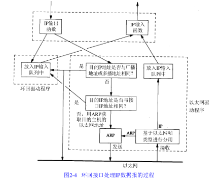

链路层主要有三个目的：

1.为IP模块发送和接收IP数据报

2.为ARP模块发送ARP请求和接收ARP应答

3.为RARP发送RARP请求和接收RARP应答

# 2.4 SLIP：串行线路IP

SLIP是一种在串行线路上对IP数据报进行封装的简单形式。

定义SILP协议的帧格式：

1.IP数据报以一个END(0xc0)的特殊字符结束。

2.如果IP报文中某个字符为END，那么就要连续传输两个字节0xdb和0xdc来取代它。

3.如果IP报文中某个字符为SLIP的ESC字符，那么就要连续传输两个字节0xdb和0xdd来取代它。

缺陷：

1.每一端必须知道对方的IP地址。没有办法把本端的IP地址通知给另一端。

2.数据帧中没有类型字段。如果一条串行线路用于SLIP，那么它不能同时使用其他协议。

3.SLIP没有在数据帧中加上检验和。如果SLIP传输的报文被线路噪声影响而发生错误，只能通过上册协议来发现。

# 2.6 PPP：点对点协议

点对点协议修改了SLIP协议中的所有缺陷，PPP包含以下三个部分：

1.在串行链路上封装IP数据报的方法。PPP支持数据为8位和无奇偶检验的异步模式，还支持面向比特的同步链接。

2.建立、配置及测试数据链路的链路控制协议。允许通信双方进行协商，以确定不同的选项。

3.针对不同网络层协议的网络控制协议体系。

PPP每一帧都以标志字符0x7e开始和结束。紧接着是一个字节地址，值始终是0xff，然后是一个值位0x03的控制字节。

CRC字段(或FCS，帧检验序列)是一个循环冗余检验码，一检测数据帧中的错误。标志字符的值是0x7e，当该字符出现在信息字段中时，PPP需要对它进行转义，通过比特填充完成的。

PPP比SLIP具有下面这些优点：

1.PPP支持在单根串行线路上运行多种协议

2.每一帧都有循环冗余检验

3.通信双方可以进行IP地址的动态协商(使用IP网络控制协议)

4.与CSLIP类似，对TCP和IP报文首部进行压缩

5.链路控制协议可以对多个数据链路选项进行设置

付出的代价：每一帧首部增加3个字节，当建立链路时要发送几帧协商数据，已经更为复杂的实现

# 2.7 环回接口

大多数的产品都支持环回接口，以允许运行在同一台主机上的客户程序和服务器程序通过TCP/IP进行通信。A类网络号127就是为环回接口预留的。根据惯例，大多数系统把IP地址127.0.0.1分配给这个接口，并命名位localhost。一个传给环回接口的IP数据报不能在任何网络上出现。

图中需要指出的关键点：

1.传给环回地址(一般是127.0.0.1)的任何数据均作为IP输入。

2.传给广播地址或多播地址的数据报赋值一份传给环回接口，然后送到以太网上。因为广播传送和多播传送的定义包含主机本身。

3.任何传给该主机IP地址的数据均送到环回接口。

# 2.8 最大传输单元MTU

以太网和802.3对数据帧的长度有一个限制，其最大值分别是1500和1492字节，链路层这个特性称作MTU(最大传输单元)。如果IP层有一个数据报要传，而且数据的长度比链路层的MTU还大，那么IP层就需要分片，把数据报分成若干片，这样每一片都小于MTU。

# 2.9 路径MTU

两台主机之间通信需要多个网络，每个链路层就可能有不同的MTU，其中路径最小的MTU被称作路径MTU。