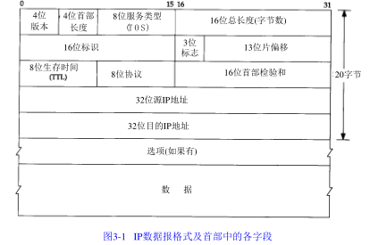

# 3.1 引言

IP是TCP/IP协议族中最核心的协议。提供不可靠、无连接的数据报传送服务

**不可靠**的意思是它不能保证IP数据报能成功地到达目的地。

**无连接**的意思是IP并不维护任何关于后续数据报的状态信息。每个数据报的处理是相互独立
的。

# 3.2 IP首部

普通的IP首部长位20个字节，除非含有选项字段。

TCP/IP首部中所有的二进制整数在网络中传输时都是用大段对齐，又称为网络字节序。

**首部长度**指的是首部占32bit字的数目，包括任何选项。最长60字节。

**服务类型**(TOS)字段包括一个3bit的优先权子字段(现已忽略)，4bit的TOS子字段和1bit未占用位但必须置0。4bit的TOS分别代表：最小延迟，最大吞吐量，最高可靠性和最小费用。

**总长度字段**是指整个IP数据报的长度，以字节为单位。是IP首部中必要的内容，因为一些数据链路(如以太网)需要填充一些数据以达到最小长度。

**标识字段**唯一地标识主机发送的每一份数据报。

**TTL**生存时间字段设置了数据报可以经过最多的路由器数。

**首部检验和**字段是根据IP首部计算的检验和码。它不对首部后面的数据进行计算。

最后一个字段是任选项，是数据报中的一个可变长的可选信息。定义如下：

·安全记录和处理限制

·记录路径

·时间戳

·宽松的源站选路

·严格的源站选路

# 3.3 IP路由选择

如果目的主机与源主机直接相连或都在一个共享网络上，那么IP数据报就直接送到目的主机上。否则主机把数据报法网一默认路由器上，有路由器来转发该数据报。

IP层内存中有一个路由表。当收到一份数据报并进行发送时，它都要对该表搜索一次。当数据来来自某个网络接口时，IP首先检查目的IP地址是否为本机的IP地址之一或者IP广播地址。如果确实是这样的，数据报就会被送到由IP首部协议字段所指定的协议模块进行处理。如果数据报的目的不是这些地址，那么：

1.如果IP层被设置为路由器的功能，那么数据报进行转发

2.数据报被丢弃

路由表中每一项都包含下面这些信息：

1.目的IP地址。它既可以是一个完整的主机地址，也可以是一个网络地址，由该表目中的标志字段来指定。

2.下一站(或下一跳)路由器的IP地址，或者有直接连接的网络IP地址。

3.标志。其中一个标志指明目的IP地址是网络地址还是主机地址，另一个标志指明下一站路由器是否为真正的下一站路由器，还是一个直接相连的接口。

4.为数据报的传输指定一个网络接口。

IP路由选择是逐跳地进行的。IP并不知道到达任何目的的完整路径。所有的IP路由选择只为数据报传输提供下一站路由器的IP地址。它假定下一站路由器比发送数据报的主机更接近目的，而且下一站路由器与该主机是直接相连的。

IP路由选择主要完成以下这些功能：

1.搜索路由表，寻找能与目的IP地址完全匹配的表目。如果找到，则把报文发送给该标目指定的下
一站路由器或直接连接的网络接口。

2.搜索路由表，寻找能与目的的网络号相匹配的表目。如果找到，则把报文发送给该表目指定的下一站路由器或直接连接的网络接口。目的网络上的所有主机都可以通过这个表目来处置。

3.搜索路由表，寻找标为"默认"的表目。如果找到，则把报文发送给该表目指定的下一站路由器。

4.如果上面这些步骤没有成功，那么该数据报就不能被传送，如果来自本机，那么一般会向生成数据报的程序返回一个"主机不可达"或"网络不可达"的错误。

为一个网络指定一个路由器，而不必为每个主机指定一个路由器。这是IP路由选择机制的另一个基本特性。

# 3.4 子网寻址

子网寻址把主机号再分成一个子网号和一个主机号。

# 3.5 子网掩码

IP地址以点分十进制方法表示，子网掩码经常用十六进制来表示，特别是当界限不是一个字节时，
因为子网掩码是一个比特掩码。

给定IP地址和子网掩码以后，主机就可以确定IP数据报的目的是：

1.本子网上的主机

2.本网络中其他子网中的主机

3.其他网络上的主机