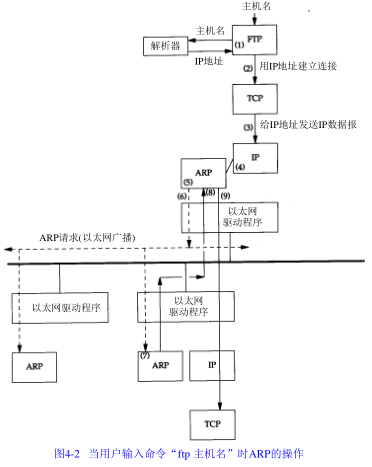
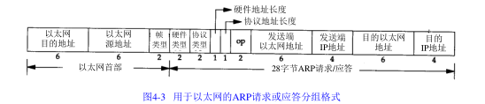

# 4.1 引言

**APR**：为IP地址到对应的硬件地址之间提供动态映射。

**RARP**：被那些没有磁盘驱动器的系统使用，它需要系统管理员进行手工设置。

# 4.2 一个例子



任何时候我们敲入下面这个形式的命令：
```
ftp bsdi
```
都会进行以下这些步骤：

1.应用程序FTP客户端调用函数gethostbyname(3)把主机名转换成32bit的IP地址。

2.FTP客户端请求TCP用得到的IP地址建立链接。

3.TCP发送一个连接请求分段到远端的主机，即用上述IP地址发送一份IP数据报。

4.如果目的主机在本地网络上，那么IP数据报可以直接送到目的主机上。如果目的主机在一个远程网络上，那么就通过IP选路函数来确定位于本地网络上的下一站路由器地址，并让它转发IP数据报。

5.假定是一个以太网，那么发送端主机必须把32bit的IP地址变换成48bit的以太网地址。从逻辑Internet地址到对应的物理硬件地址需要进行翻译。这就是ARP的功能。ARP本来是用于广播网络的，有许多主机或路由器连在同一网络上。

6.ARP发送一份称作ARP请求的以太网数据帧给以太网的每个主机。这个过程称作为广播。

7.目的主机的ARP层收到这份广播报文后，识别出这是发送端在询问它的IP地址，于是发送了一个ARP应答。这个ARP应答包含IP地址及对应的硬件地址。

8.收到ARP应答后，使ARP进行请求一应答交换的IP数据报现在就可以传送了。

9.发送IP数据报到目的主机。

# 4.3 ARP高速缓存

每一个主机都有一个ARP高速缓存。这个高速缓存存放了最近Internet地址到硬件地址之间的映射记录。

# 4.4 ARP的分组格式



# 4.6 ARP代理

ARP请求如果是从一个网络的主机发往另一个网络上的主机，那么连接这两个网络的路由器就可以回答该请求，这个过程称作ARP或ARP代理。这样可以欺骗发送ARP请求的发送端，让它误以为路由器就是目的主机。

ARP代理的其他用途：通过两个物理网络之间的路由器可以互相隐藏物理网络。

# 4.7 免费ARP

免费ARP指主机发送ARP查找自己的IP地址。

免费ARP可以有两个方面的作用：

1.一个主机可以通过它来确定另一个主机是否设置了相同的IP地址。

2.如果发送免费ARP的主机正好改变了硬件地址，那么这个分组就可以使其他主机高速缓存中旧的硬件地址进行相应的更新。